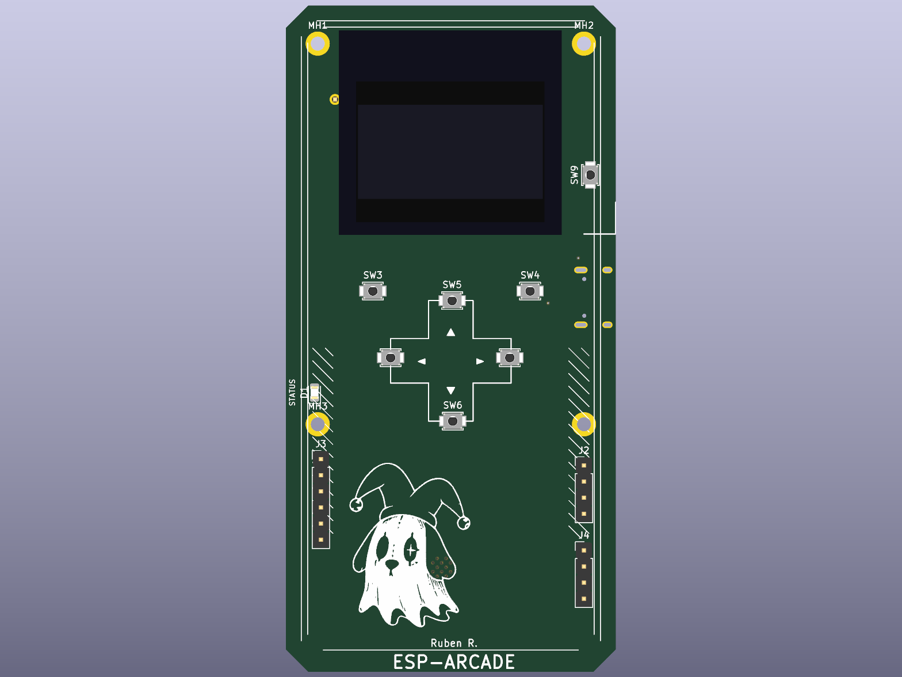
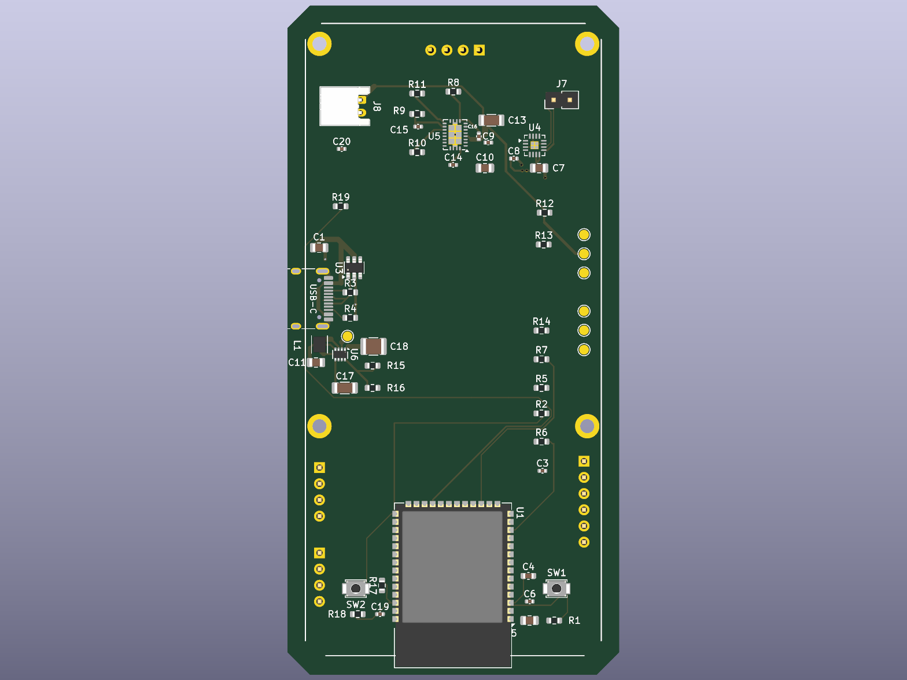

# 🎮 ESP-Arcade — Mini Consola Retro ESP32

**Autor:** Ruben R  
**Versión:** 0.2  
**Plataforma (prototipo):** ESP32 (DOIT ESP32 DEVKIT V1)  
**Plataforma (PCB):** ESP32-S3-WROOM-1  
**Framework:** Arduino (PlatformIO)

---

## 🧠 Descripción general

Proyecto personal de una **mini consola retro** basada en un **ESP32**, diseñada para correr juegos sencillos en una **pantalla OLED**.  
El objetivo es aprender sobre **sistemas embebidos**, **hardware modular** y **arquitectura de software para juegos en microcontroladores**.

El proyecto tiene dos partes:

- **Firmware:** menú y juegos, hoy probado en un prototipo con ESP32 DevKit V1 en protoboard.
- **Hardware:** una PCB propia de 4 capas con componentes SMD, pensada para una **carcasa impresa en 3D**.

---

## 🧩 Características principales

- Pantalla OLED 128x64 (I²C)
- Botones físicos de control (4 direccionales + botones de acción)
- Menú principal para seleccionar juegos
- Juegos implementados: **Snake** y **Pong** (_Tetris_ planeado)
- Diseño modular (cada juego en su propio archivo)

---

## 🔌 PCB (en desarrollo)

Diseño hecho en KiCad. Estado: **diseño casi terminado, aún sin fabricar**.

|                Vista superior                |                Vista inferior                |
| :------------------------------------------: | :------------------------------------------: |
|  |  |

_Renders 3D generados con KiCad._

**Resumen del diseño:**

| Bloque           | Componente                                        |
| ---------------- | ------------------------------------------------- |
| Microcontrolador | ESP32-S3-WROOM-1                                  |
| Alimentación     | USB-C con protección ESD (USBLC6-2SC6)            |
| Batería          | Cargador LiPo BQ24070 y conector JST              |
| Regulación       | TPS631000 (buck-boost)                            |
| Audio            | Amplificador I²S MAX98357A                        |
| Interfaz         | Header para OLED, botones SMD y LED de estado     |
| Placa            | 4 capas (señal, alimentación, GND, señal)         |

**Pendiente:**

- Correr el DRC final y terminar el ruteo.
- Adaptar el firmware al ESP32-S3 y a los pines reales de la PCB.
- Publicar el esquema (PDF) y los archivos de fabricación.

---

## 🧰 Hardware y materiales (prototipo en protoboard)

| Componente            | Descripción                | Cantidad | Notas                                      |
| --------------------- | -------------------------- | -------- | ------------------------------------------ |
| ESP32 DevKit V1       | Microcontrolador principal | 1        | 4 MB Flash, WiFi, BLE                      |
| OLED 0.96" (SSD1306)  | Pantalla gráfica I²C       | 1        | 128x64 píxeles                             |
| Pulsadores táctiles   | Botones de control         | 5        | Arriba, Abajo, Izquierda, Derecha, Aceptar |
| Buzzer piezoeléctrico | Generar sonido             | 1        | Opcional                                   |
| Resistencias 10kΩ     | Pull-up para botones       | 5        | Opcional si no son internas                |
| Protoboard y cables   | Montaje temporal           | 1 set    | —                                          |
| Fuente de 5V (USB)    | Alimentación               | 1        | —                                          |

> 

---

## ⚙️ Conexiones de pines del prototipo (Pantalla)

| Componente | Pin ESP32 | Descripción     |
| ---------- | --------- | --------------- |
| OLED SDA   | Pin 21    | Datos I²C       |
| OLED SCL   | Pin 22    | Reloj I²C       |
| 3.3V       | Vcc       | Entrada digital |
| GND        | GND       | Entrada digital |

> 

---

## ⚙️ Conexiones de pines del prototipo (Botones)

| Componente | Pin ESP32 | Descripción     |
| ---------- | --------- | --------------- |
| UP         | Pin 33    | Entrada digital |
| Down       | Pin 32    | Entrada digital |
| Left       | Pin 25    | Entrada digital |
| Right      | Pin 26    | Entrada digital |


---

## ⚙️ Conexiones de pines (DAC Module)

| Componente | Pin ESP32 | Descripción     |
| ---------- | --------- | --------------- |
| Pin 3      | Pin 9     | Entrada digital |
| Pin 2      | Pin 10    | Entrada digital |


---

## 💾 Librerías utilizadas

Estas se agregan automáticamente en `platformio.ini`:

```ini
lib_deps =
  adafruit/Adafruit GFX Library
  adafruit/Adafruit SSD1306
```

## Video y documentacion de los que me he basado

> [Video de pantalla] https://www.youtube.com/watch?v=_KD7skmusTQ
